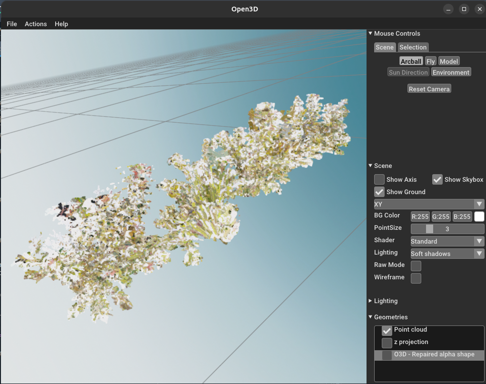
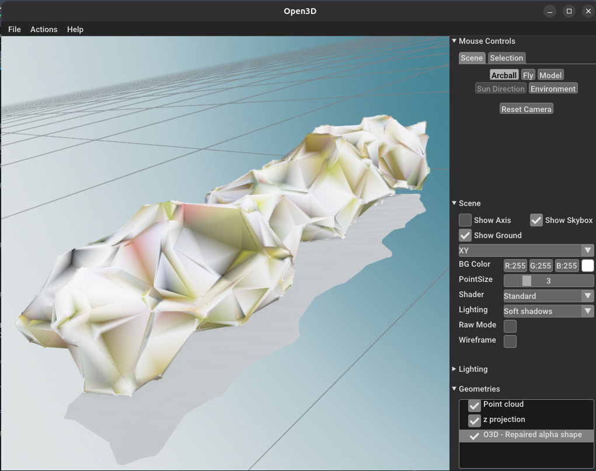

# envelope_cloud
Python tool to compute the envelope (alpha shape) of a 3D point cloud (stored in a .txt file, but with some minor modifications, other type of files could be treated), save it and  save some related metrics (volume and area of the alpha shape, projected area on the ground, accuracy of the alpha shape, number of envelopes).

## Example

Below are two example images demonstrating the functionality of the project:

<div style="display: flex; justify-content: space-around; align-items: center;">
  <div style="text-align: center;">
    
    <p>Legend for Image 1: This image shows [describe the content or purpose of the image].</p>
  </div>
  <div style="text-align: center;">
    
    <p>Legend for Image 2: This image shows [describe the content or purpose of the image].</p>
  </div>
</div>


## Installation

To install and set up the project, follow these steps:

### Prerequisites

Ensure you have the following installed on your system:
- [Git](https://git-scm.com/)
- [Anaconda](https://www.anaconda.com/products/distribution) or [Miniconda](https://docs.conda.io/en/latest/miniconda.html)

### Step-by-Step Guide

1. **Clone the Repository**

   Open a terminal and run the following command to clone the repository:

   ```bash
   git clone https://github.com/cyrilbz/envelope_cloud.git
   ```
2. ** Move to the directory, create a dedicated Conda environement, and install all requirements**
   ```bash
   cd envelope_cloud

   conda create --name envelope python=3.12.0

   conda activate envelope

   pip install -r requirements.txt
   ```
